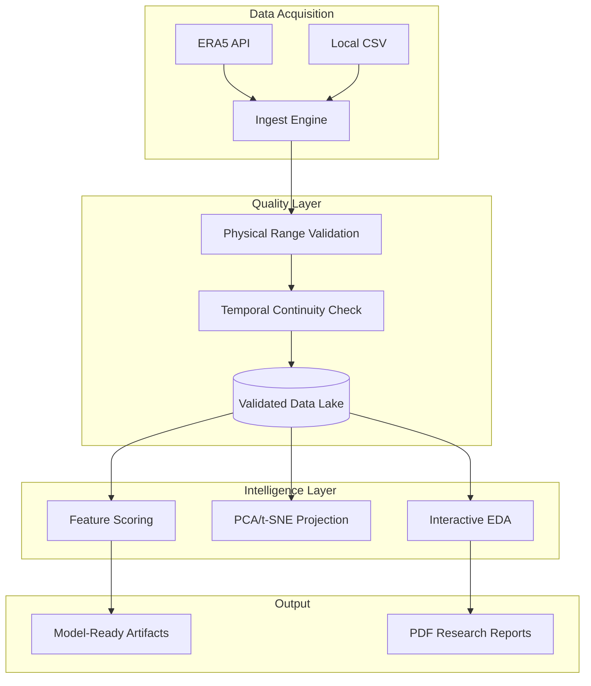

# ⛈️ StormLens: Meteorological Intelligence Platform

**StormLens** is an end-to-end data engineering and intelligence framework designed for high-resolution atmospheric research and thunderstorm prediction. It automates the lifecycle of meteorological data from ERA5 reanalysis ingestion to interpretable feature intelligence.

---

## 🚀 Key Features

### 1. Ingestion & Data Lake
- **Automated ERA5 Pipeline:** Direct connectivity to the Copernicus CDS API with background polling and NetCDF-to-CSV conversion.
- **Structured Storage:** Automated cataloging of raw, validated, and processed datasets.

### 2. Scientific Validation
- **Quality Engine:** Automated meteorological range checks (e.g., CAPE > 0, Temp > -100C) and timestamp continuity verification.
- **Integrity Scoring:** Real-time data quality metrics and anomaly logging.

### 3. Advanced Intelligence
- **Automated EDA:** Interactive dashboards for distribution analysis, temporal trends, and correlation heatmaps.
- **Dimensionality Reduction:** 3D atmospheric state projections using PCA (with Biplots) and t-SNE.
- **Feature Scoring:** Statistical ranking of thunderstorm precursors using Mutual Information and Pearson scores.

### 4. MLOps & Reporting
- **Model Readiness:** Automated assessment of dataset suitability for interpretable ML models (EBM, GAM).
- **Research Export:** On-demand generation of comprehensive research summaries and data catalogs.

---

## 🛠️ Architecture

---

## 💻 Tech Stack
- **Languages:** Python 3.9+
- **Frontend:** Streamlit (Custom CSS/JS)
- **Data:** Pandas, Xarray, Numpy, scikit-learn
- **Visualization:** Plotly (Interactive 3D/2D)
- **Deployment:** Docker, Streamlit Cloud

---

## 📝 CV / Portfolio Impact

If you are showcasing this project, emphasize these engineering highlights:
- **"Designed a modular meteorological data pipeline... "**
- **"Implemented a physical rule-based validation engine... "**
- **"Developed interactive 3D atmospheric projections... "**
- **"Built a research-ready reporting system... "**

---

## 🏁 Getting Started

1. **Clone the repo:** `git clone https://github.com/your-username/StormLens.git`
2. **Install dependencies:** `pip install -r requirements.txt`
3. **Set API Secrets:** Add your CDS API credentials to `.streamlit/secrets.toml`
4. **Run the App:** `streamlit run main.py`

---

*StormLens: Turning raw data into atmospheric insight.*
